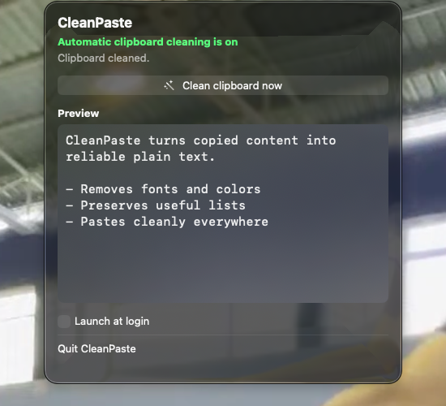
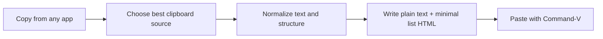

<div align="center">

# CleanPaste

**Paste clean text everywhere — without changing how you copy and paste.**

[](CleanPaste/Package.swift)
[](CleanPaste/Package.swift)
[](CleanPaste/docs/privacy.md)
[](LICENSE)



</div>

CleanPaste is a native macOS menu-bar utility that turns messy clipboard content into a stable, paste-ready representation. It removes source styling while preserving useful structure such as paragraphs, headings, and lists.

Copy normally. Paste normally. CleanPaste works in between.

## Why CleanPaste

- **Automatic** — watches the clipboard and cleans supported content immediately.
- **Paste-stable** — writes a versioned plain-text contract plus minimal semantic HTML for real lists.
- **Formatting-free** — removes source fonts, colors, bold styling, and other visual baggage.
- **Local and private** — clipboard content never leaves the Mac; no analytics or external services.
- **Recoverable** — selects the best available clipboard representation before transforming it.
- **Transparent** — the menu-bar preview shows exactly what will be pasted.

## Requirements

- macOS 14 or newer
- Swift 6 toolchain / Xcode 16 or newer

## Build and run

```bash
git clone https://github.com/size12font/clean-paste.git
cd clean-paste
./script/build_and_run.sh
```

CleanPaste appears in the menu bar. Copy text in any app, then use normal `Command-V`.

The optional `Command-Shift-V` shortcut can clean and paste in one action. Accessibility permission is needed only when CleanPaste sends the paste keystroke for you; automatic cleaning and normal `Command-V` do not need it.

## How it works



## What gets preserved

| Preserved | Removed |
| --- | --- |
| Paragraphs and line breaks | Fonts and font sizes |
| Headings as readable text | Text and background colors |
| Numbered and bulleted lists | Bold, italic, underline styling |
| URLs and meaningful Unicode | Source-app metadata and rich styling |

## Privacy

CleanPaste processes clipboard data locally and sends no clipboard content to external services. It does not include analytics or telemetry. See the complete [privacy notes](CleanPaste/docs/privacy.md) and [permission guide](CleanPaste/docs/permissions.md).

## Architecture

| Path | Responsibility |
| --- | --- |
| [`CleanPaste/Sources/ClipCore`](CleanPaste/Sources/ClipCore) | Clipboard extraction, normalization, and canonical paste contract |
| [`CleanPaste/CleanPasteMac/CleanPasteMacCore`](CleanPaste/CleanPasteMac/CleanPasteMacCore) | Pasteboard monitoring, writing, permissions, hotkey, and preview services |
| [`CleanPaste/CleanPasteMac/CleanPasteMac`](CleanPaste/CleanPasteMac/CleanPasteMac) | Native SwiftUI menu-bar app |
| [`CleanPaste/tools`](CleanPaste/tools) | QA, fixture capture, Shortcut, and target-smoke executables |
| [`CleanPaste/qa`](CleanPaste/qa) | Conformance fixtures, capability declarations, and regression evidence |

## Verify

```bash
swift test --package-path CleanPaste
swift run --package-path CleanPaste CleanPasteQA
swift run --package-path CleanPaste CleanPasteTargetSmoke
swift run --package-path CleanPaste CleanPasteShortcutQA
./script/build_and_run.sh --verify
```

## Beta builds

`./script/package_dmg.sh` creates a Developer ID-signed, Apple-notarized DMG for external testers. See [release instructions](CleanPaste/docs/release.md) before sharing a build. `--local-only` builds are for the current Mac and should not be distributed.

## Contributing

Bug reports and focused pull requests are welcome. Start with [CONTRIBUTING.md](CONTRIBUTING.md). Please do not attach sensitive clipboard content to issues; use a minimal synthetic reproduction.

Security reports should use GitHub's private vulnerability reporting flow described in [SECURITY.md](SECURITY.md).

## License

MIT © CleanPaste contributors.
