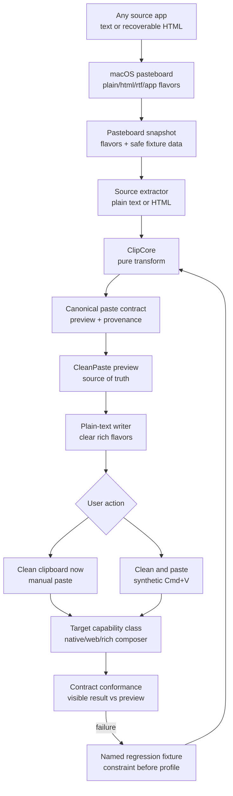

# CleanPaste - Plan

## Goal Capsule

| Field | Value |
|---|---|
| Objective | Build CleanPaste: a local macOS utility that lets the user copy from anywhere, then paste anywhere else with the same CleanPaste-normalized formatting. |
| Source of truth | The user-approved CleanPaste preview: "this is how it should look in every other application." Every target paste is compared against that preview, not against source-app HTML, RTF, or app-specific clipboard data. |
| Core bet | One canonical plain-text contract plus target-capability conformance scales better than a pairwise source-to-app matrix. |
| Execution profile | Greenfield Swift package plus macOS menu-bar app; fixture-first implementation before UI polish. |
| Stop conditions | Stop if the canonical contract cannot remain source-independent, if a target capability class cannot consume plain text consistently, or if Accessibility permission blocks automated paste without clean manual fallback. |
| Tail ownership | `ce-work` owns implementation, local verification, simplification, and review; release signing/notarization remains a separate distribution step. |

---

## Product Contract

### Summary

CleanPaste solves paste drift by making a clean preview the canonical output, then writing only that output to the clipboard. MVP is source-agnostic and target-agnostic: source extractors translate pasteboard flavors into one canonical paste contract, while target conformance is proven by capability class rather than by every source/destination pair.

### Problem Frame

Apps put multiple representations on the clipboard: plain text, HTML, RTF, and app-specific data. Target apps choose different representations and sanitize them differently, so the same copied text can paste differently depending on both source and destination.

The observed LinkedIn-to-Buffer success is strong evidence that a simpler intermediate representation works better than raw source-app clipboard data. CleanPaste should make that intermediate step explicit: normalize once into a canonical contract, preview once, then validate that contract against target capability classes.

The product should not chase full rich-text fidelity in v1. The valuable outcome is same normalized formatting across apps: same line breaks, same paragraph spacing, same readable bullets, and no hidden HTML/RTF styling that target apps can misinterpret.

### Actors

- A1. Johnny, copying text from any app and pasting it into any other app.
- A2. Source app, any app that places text or recoverable HTML on the macOS pasteboard.
- A3. Target app, any app that accepts plain-text paste.
- A4. CleanPaste, reading the clipboard, producing the canonical preview, writing plain text, and optionally triggering paste.

### Requirements

**Canonical output**

- R1. CleanPaste must produce a user-visible preview that represents exactly how the paste should look in other applications.
- R2. CleanPaste must preserve structural text intent: paragraphs, one blank line between paragraphs, lists, numbered steps, code-ish blocks, table rows degraded to text, and links.
- R3. CleanPaste must strip formatting noise: bold/italic markers, source HTML styling, RTF styling, hidden spans, zero-width characters, and extra whitespace.
- R4. CleanPaste must leave legitimate typography intact, including smart quotes and em dashes.
- R5. CleanPaste must define "same formatting" as matching the CleanPaste preview, not matching every source app's rich rendering.
- R23. CleanPaste must represent normalized output as one canonical paste contract containing preview text, selected source flavor, observed pasteboard types, and a transform version.

**Clipboard behavior**

- R6. CleanPaste must inspect available clipboard text flavors before mutating the clipboard.
- R7. CleanPaste must accept any source app that provides plain text or recoverable HTML.
- R8. CleanPaste must prefer source plain text when present, using HTML only to recover block structure when plain text is missing or unusable.
- R24. Source handling must be extractor-based: adding a new recoverable pasteboard flavor requires one extractor and no target-specific changes.
- R9. CleanPaste must clear source rich clipboard flavors, always write canonical `public.utf8-plain-text`, and add only minimal semantic HTML for numbered or bulleted lists.
- R10. CleanPaste must offer "Clean clipboard now" and "Clean and paste" actions.
- R11. CleanPaste must fall back to "clipboard cleaned, press paste yourself" when automated paste is unavailable.
- R12. CleanPaste may restore the original clipboard after clean-paste, but only when timing is proven safe.

**Platform scope**

- R13. The v1 app must be a native macOS menu-bar app.
- R14. Shared transform logic must live in a Swift package with deterministic unit tests.
- R15. iOS support is deferred to a Shortcut that mirrors the same simple text rules, with App Intent support only if Shortcut drift becomes a problem.

**Evidence and QA**

- R16. Before implementation, the project must capture real clipboard fixtures from varied source categories: AI chat, browser text, rich doc editor, social editor, messaging app, code/plain editor, and webpage selection.
- R17. Each fixture must store raw observed flavors where safe, expected CleanPaste preview text, and transform output.
- R18. QA must compare every source fixture against the canonical preview and run that output through representative target capability classes.
- R19. The MVP must verify at least native text input, browser textarea, browser contenteditable, and rich-editor/composer capability classes without enumerating every source/destination pair.
- R25. Target capability classes must declare observable constraints such as plain-text acceptance, newline preservation, list preservation, maximum length, and known mutation behavior.
- R26. Specific apps such as Buffer, LinkedIn, Slack, Telegram, Google Docs, and Notion are exploratory spot checks or regression cases, not release-blocking matrix columns.
- R27. An app-specific profile may be proposed only after a reproducible failure shows that the app violates a target capability contract.

**Privacy and control**

- R20. CleanPaste must run locally and send no clipboard content to external services.
- R21. Fixture capture must avoid saving sensitive clipboard content unless the user explicitly chooses full capture.
- R22. Permission failures must leave the clipboard in a clear, documented state.

### Key Flows

- F1. Clean clipboard now.
  - **Trigger:** User copies text from any source app and selects Clean clipboard now.
  - **Actors:** A1, A2, A4.
  - **Steps:** CleanPaste snapshots clipboard flavors, runs ClipCore, shows or records the canonical preview, clears clipboard contents, writes only clean plain text.
  - **Outcome:** User can paste manually into any target app that accepts text and see the preview's structure.

- F2. Clean and paste.
  - **Trigger:** User copies text and presses the global CleanPaste hotkey.
  - **Actors:** A1, A2, A3, A4.
  - **Steps:** CleanPaste cleans clipboard, writes plain text, sends paste when Accessibility permission allows it, then optionally restores original clipboard after a safe delay.
  - **Outcome:** Plain targets receive canonical text; rich targets can create actual numbered and bulleted lists from minimal semantic HTML.

- F3. Capture target capability mismatch as fixture.
  - **Trigger:** A target app output differs from the CleanPaste preview.
  - **Actors:** A1, A3, A4.
  - **Steps:** User saves source app, source snapshot, CleanPaste preview, target app, observed result, and notes.
  - **Outcome:** The failure becomes a regression test or an explicit target limitation.

### Acceptance Examples

- AE1. Given a ChatGPT answer with short paragraphs separated by blank lines, when CleanPaste runs, then the preview has exactly one blank line between paragraphs and every conforming target harness preserves it.
- AE2. Given copied text from any app with Markdown emphasis, when CleanPaste runs, then the preview removes emphasis markers while keeping the words and paragraph structure.
- AE3. Given source text containing `snake_case`, `file_name.txt`, smart quotes, and em dashes, when CleanPaste runs, then those remain unchanged.
- AE4. Given source text with `U+00A0`, `U+202F`, thin spaces, or zero-width characters, when CleanPaste runs, then spacing is normalized without changing visible meaning.
- AE5. Given source HTML with paragraphs, divs, breaks, and list items but no usable plain text, when CleanPaste runs, then block structure becomes readable plain text.
- AE6. Given Accessibility permission is denied, when user triggers Clean and paste, then CleanPaste cleans the clipboard and instructs user to paste manually.
- AE7. Given the same CleanPaste preview, when pasted into native text input, browser textarea, browser contenteditable, and rich-editor/composer harnesses, then visible paragraph/list structure matches the preview or the capability constraint is recorded.
- AE8. Given a new target app that accepts plain text and matches an existing capability class, when it is evaluated, then no new source-target mapping or workflow change is required.
- AE9. Given a specific app that mutates canonical plain text, when the failure is reproduced, then it becomes a named regression fixture and target constraint before any app-specific profile is designed.

### Scope Boundaries

In scope:

- Native macOS menu-bar app.
- Swift package for pure transform logic.
- Source-agnostic text normalization for any app that provides plain text or recoverable HTML.
- Target-agnostic plain-text paste for any app that accepts text.
- Target-capability conformance tests for native text, web text, and rich/composer surfaces.
- Plain-text-only clipboard output for v1.
- Manual and hotkey-triggered flows.
- Fixture capture and contract conformance across representative source categories and target capability classes.
- Optional original-clipboard restore after timing proof.

#### Deferred to Follow-Up Work

- Per-app rich profiles using HTML/RTF.
- Passive clipboard interception after every copy.
- Browser extension copy/paste overrides.
- Full iOS app with App Intent.
- Mac App Store distribution.
- Windows/Linux support.
- Platform API connectors, authentication, content scheduling, capability routing across services, and MCP tool discovery.

#### Outside This Product's Identity

- A rich text editor.
- A cloud clipboard-history service.
- An AI rewriting or style-improvement tool.
- A promise that all apps render rich text identically.

---

## Planning Contract

### Comparison Outcome

The generalized-architecture input is correct about avoiding pairwise matrices, but its API connectors, authentication, content model, and intent router solve a different product. CleanPaste adopts the transferable principle at the clipboard layer: one canonical paste contract, source extractors, target capability classes, and contract conformance. It does not become a cross-platform publishing system.

This update keeps CleanPaste's plain-text architecture, fixture-first sequencing, exact transform spec, macOS menu-bar app, and iOS Shortcut follow-up. It removes the release-blocking live app matrix and replaces it with scalable capability-class conformance plus app-specific regression evidence when failures occur.

### Assumptions

- The highest-probability v1 fix is structural plain text, not richer profile-specific clipboard bundles.
- The canonical paste contract is the expected output every conforming target class should preserve, regardless of original source app.
- "Paste from anywhere" means any source that places plain text or recoverable HTML on the pasteboard; unsupported binary-only clipboards fail with a clear message.
- "Paste anywhere" means any target that accepts plain-text paste; targets may still wrap text visually, but paragraph/list structure should match the CleanPaste preview.
- Named app checks are diagnostic spot checks; target capability conformance is the release gate.

### Key Technical Decisions

- KTD1. Build native macOS first. Use Swift/AppKit/SwiftUI because the core problem is macOS pasteboard behavior and global hotkey/paste control.
- KTD2. Put transform logic in `ClipCore`. Keep parsing and cleanup pure, deterministic, dependency-light, and unit-testable outside the app UI.
- KTD3. Always write canonical plain text. Add generated HTML only when list semantics are present, limited to escaped paragraphs, `<ol>`, `<ul>`, and `<li>`; never forward source HTML/RTF.
- KTD4. Use the CleanPaste preview as oracle. QA compares every contract-conformance result against the preview, making "correct" visible and non-subjective.
- KTD5. Prefer plain text input, use HTML as fallback. Source plain text usually best reflects user-visible content; HTML fallback exists only to recover block structure when needed.
- KTD6. Ship explicit actions before automation. Menu item and hotkey are enough; passive monitoring waits until trust and permissions are proven.
- KTD7. Keep iOS simple. Use Shortcuts and Back Tap as regex-based v1 mirror; only build an iOS app/App Intent if Shortcut output diverges from ClipCore.
- KTD8. Replace pairwise source-target QA with contract conformance. Source fixtures prove extraction and normalization; target capability harnesses prove delivery behavior. This changes verification growth from source-count multiplied by target-count to source fixtures plus capability classes.
- KTD9. Treat apps as evidence, not architecture. Buffer, LinkedIn, Slack, Telegram, Google Docs, Notion, and future apps become spot checks or named regressions only when they expose behavior not represented by an existing capability class.
- KTD10. Do not add platform connectors or intent routing. CleanPaste operates through the macOS pasteboard and focused target; auth, service APIs, scheduling, search, and MCP tool discovery are outside this product's identity.

### Canonical Paste Contract

```yaml
CanonicalPaste:
  preview_text: String
  source_flavor: plain_text | html
  observed_types: [String]
  transform_version: String
```

Target capability declarations stay behavioral rather than platform-named:

```yaml
TargetCapability:
  kind: native_text | web_textarea | web_contenteditable | rich_composer
  accepts_plain_text: Bool
  preserves_newlines: Bool
  preserves_list_markers: Bool
  maximum_length: Int?
  known_mutations: [String]
```

### Transform Spec

| Step | Rule |
|---|---|
| Flavor selection | Prefer plain text. If plain text is absent or empty and HTML exists, convert HTML to text preserving block structure. |
| HTML to text | Map `<p>`, `<div>`, section blocks, and headings to paragraph breaks; map `<br>` to line break; map `<li>` to list line; ignore inline styling tags. |
| Unicode cleanup | Replace non-breaking spaces, narrow non-breaking spaces, and thin spaces with regular spaces. Delete zero-width characters and byte-order marks. Keep smart quotes and em dashes. |
| Markdown strip | Remove pair-aware bold/italic markers, header prefixes, inline backticks, and code fences while preserving code contents. Convert Markdown links to `text (url)`. Preserve `snake_case` and filenames. |
| List cleanup | Normalize common bullet markers to a configured bullet style, or keep original markers if user preference says so. Preserve numbered list order. |
| Table degradation | Convert simple table rows to tab-separated or spaced text lines; do not attempt rich table fidelity. |
| Newline normalization | Convert CRLF/CR to LF, trim trailing whitespace per line, collapse 3+ consecutive newlines to exactly 2. |
| Output | Produce one plain-text string and write only the plain-text pasteboard flavor. |

### High-Level Technical Design



### Output Structure

```text
CleanPaste/
  Package.swift
  Sources/
    ClipCore/
      PasteboardContent.swift
      CanonicalPaste.swift
      SourceExtractor.swift
      CleanPasteTransform.swift
      HTMLBlockExtractor.swift
      MarkdownStripper.swift
      UnicodeCleaner.swift
      NewlineNormalizer.swift
  Tests/
    ClipCoreTests/
      Fixtures/
      CleanPasteTransformTests.swift
      HTMLBlockExtractorTests.swift
      MarkdownStripperTests.swift
  CleanPasteMac/
    CleanPasteMac/
      App/
      Views/
    CleanPasteMacCore/
      Clipboard/
      Hotkey/
      Permissions/
      Preview/
    CleanPasteMacTests/
  Tools/
    CleanPasteQA/
    CleanPasteTargetSmoke/
  qa/
    conformance.md
    target-capabilities.md
    app-regressions.md
  docs/
```

### Sources and Research

- Apple `NSPasteboard` docs: pasteboard server is shared by running apps and can hold common items such as strings and attributed strings. Source: https://developer.apple.com/documentation/appkit/nspasteboard
- Apple pasteboard type docs: AppKit exposes HTML and RTF pasteboard types, which confirms the need to control rich flavors rather than treating clipboard as one string. Sources: https://developer.apple.com/documentation/appkit/nspasteboard/pasteboardtype/html and https://developer.apple.com/documentation/appkit/nspasteboard/pasteboardtype/rtf
- W3C Clipboard API draft: web clipboard behavior deals in typed data, including `text/plain` and `text/html`; this explains why different web apps choose different paste inputs. Source: https://www.w3.org/TR/clipboard-apis/

### Security and Privacy Notes

- Main risk: fixture capture saves sensitive clipboard content. Mitigation: save redacted fixtures by default and require explicit user action for full raw capture.
- Automation risk: synthetic paste goes to wrong focused app. Mitigation: clean-only fallback, visible confirmation state, and no hidden passive paste in v1.
- Data boundary: CleanPaste sends no clipboard content to external services.
- Universal Clipboard risk: rewriting the general pasteboard may sync across Apple devices. Mitigation: document behavior and restore original clipboard only after proven safe timing.

### Phased Delivery

| Phase | Goal | Exit Criteria |
|---|---|---|
| Phase 0 | Evidence gathering | 8-12 real clipboard fixtures across source categories: AI chat, browser selection, rich doc editor, social editor, messaging app, code/plain editor, and webpage form field; expected preview text saved for each. |
| Phase 1 | ClipCore Swift package | Pure transform function passes fixture tests and edge-case unit tests. |
| Phase 2 | macOS menu-bar MVP | Clean clipboard now and Clean and paste work against native text and WebKit target-capability harnesses. |
| Phase 3 | iOS Shortcut | Shortcut mirrors the simple rules closely enough for top fixtures and can run through Back Tap/Share Sheet. |
| Phase 4 | QA and polish | Contract conformance suite complete, target constraints documented, launch-at-login preference, permission onboarding, restore policy, and direct-download signing plan. |
| Phase 5 | Optional shared iOS app | App Intent wraps ClipCore only if Shortcut drift or distribution needs justify it. |

### Success Metrics

- CleanPaste preview matches visible paste structure across every core source fixture and target capability class.
- Transform output is deterministic across repeated runs.
- Source examples from multiple app categories normalize without changing legitimate typography.
- Accessibility denial still leaves user with a usable clean clipboard.
- Adding a source flavor or conforming target class requires one extractor or capability declaration, not pairwise mappings.
- No target-specific rich profile exists in v1 unless a named regression proves plain text cannot satisfy the target contract.

### Risks and Dependencies

| Risk | Impact | Mitigation |
|---|---|---|
| Plain text loses formatting user wanted | User expects bold/italics to survive | Product contract says structure-only v1; rich profiles are deferred. |
| Markdown stripping damages legitimate text | `snake_case`, math, or filenames get altered | Pair-aware stripping, fixture tests, and a Unicode-cleanup-only escape action if needed. |
| HTML fallback parser misses block semantics | Plain text absent source degrades badly | Fixture-driven HTML tests from real source apps before broad parser work. |
| Source app provides no usable text or HTML | CleanPaste cannot infer intended formatting | Fail clearly before mutating clipboard and record unsupported source type. |
| Accessibility permission denied | Clean and paste cannot send keystroke | Ship clean-only fallback from day one. |
| Clipboard restore races target paste | Target receives wrong content | Keep restore optional and disabled until target timing is proven. |
| Target app still rewrites plain text | Output differs from preview | Classify the capability mismatch, capture a named regression, and only then consider target-specific follow-up. |

---

## Implementation Units

### U1. Fixture Capture and Pasteboard Evidence

- **Goal:** Capture real clipboard inputs before transform code hardens around guesses.
- **Requirements:** R6, R16, R17, R21.
- **Dependencies:** None.
- **Files:** `CleanPaste/qa/fixtures/README.md`, `CleanPaste/qa/fixtures/ai-chat/`, `CleanPaste/qa/fixtures/rich-doc/`, `CleanPaste/qa/fixtures/social-editor/`, `CleanPaste/qa/fixtures/messaging/`, `CleanPaste/qa/fixtures/code-editor/`, `CleanPaste/qa/fixtures/browser-selection/`, `CleanPaste/tools/dump-pasteboard.swift`, `CleanPaste/qa/conformance.md`.
- **Approach:** Build a tiny local pasteboard dump tool that enumerates pasteboard types, safe metadata, and optional raw textual payloads. Capture paired expected preview files by manually writing "this is how it should look" for each sample.
- **Execution note:** This unit comes first; all transform rules should be justified by these fixtures or known edge cases.
- **Patterns to follow:** Keep raw content out by default; use explicit full-capture mode for non-sensitive samples.
- **Test scenarios:**
  - Copy AI chat content and dump available pasteboard types.
  - Copy rich doc content and confirm rich flavors are recorded as metadata even if raw content is redacted.
  - Copy social editor, messaging, code/plain editor, and webpage-selection samples and save expected previews.
  - Save expected preview text for a fixture and load it in tests.
  - Attempt dump on empty/non-text clipboard and get safe no-text output.
- **Verification:** 8-12 fixture directories exist across source categories, each with observed formats and expected CleanPaste preview text.

### U2. ClipCore Package and Transform Pipeline

- **Goal:** Implement deterministic structure-only cleanup in a Swift package.
- **Requirements:** R1, R2, R3, R4, R5, R7, R8, R14, R23, R24, AE1, AE2, AE3, AE4, AE5.
- **Dependencies:** U1.
- **Files:** `CleanPaste/Package.swift`, `CleanPaste/Sources/ClipCore/PasteboardContent.swift`, `CleanPaste/Sources/ClipCore/CanonicalPaste.swift`, `CleanPaste/Sources/ClipCore/SourceExtractor.swift`, `CleanPaste/Sources/ClipCore/CleanPasteTransform.swift`, `CleanPaste/Sources/ClipCore/UnicodeCleaner.swift`, `CleanPaste/Sources/ClipCore/NewlineNormalizer.swift`, `CleanPaste/Sources/ClipCore/MarkdownStripper.swift`, `CleanPaste/Sources/ClipCore/HTMLBlockExtractor.swift`, `CleanPaste/Tests/ClipCoreTests/CleanPasteTransformTests.swift`, `CleanPaste/Tests/ClipCoreTests/Fixtures/`.
- **Approach:** Model pasteboard input through source extractors and emit a versioned canonical paste contract. Pipeline stages run in fixed order: select extractor, recover source structure, Unicode cleanup, Markdown strip, list/table cleanup, newline normalization, contract assembly.
- **Execution note:** Implement fixture tests before broad cleanup rules; every new cleanup rule needs a regression case.
- **Patterns to follow:** Pure functions, no AppKit dependency inside ClipCore except type-adapter boundaries if unavoidable.
- **Test scenarios:**
  - Covers AE1. Paragraph fixture collapses 3+ newlines to exactly one blank line.
  - Covers AE2. Markdown emphasis/header/backtick fixture strips markers but keeps words.
  - Covers AE3. `snake_case`, `file_name.txt`, smart quotes, and em dashes survive.
  - Covers AE4. NBSP, narrow NBSP, thin spaces, zero-width joiners, and BOM normalize correctly.
  - Covers AE5. HTML-only fixture preserves paragraphs, breaks, and list lines.
  - Code fence fixture removes fences but preserves inner code lines.
  - Simple table fixture degrades to readable plain text rows.
- **Verification:** `swift test --package-path CleanPaste` passes real-fixture and explicit edge-case coverage.

### U3. Canonical Pasteboard Writer

- **Goal:** Clear source flavors, write canonical preview text, and add generated semantic HTML only for list-bearing content.
- **Requirements:** R6, R9, R10, R20, R22.
- **Dependencies:** U2.
- **Files:** `CleanPaste/CleanPasteMac/CleanPasteMacCore/Clipboard/PasteboardSnapshot.swift`, `CleanPaste/CleanPasteMac/CleanPasteMacCore/Clipboard/PasteboardReader.swift`, `CleanPaste/CleanPasteMac/CleanPasteMacCore/Clipboard/PlainTextPasteboardWriter.swift`, `CleanPaste/CleanPasteMac/CleanPasteMacCore/Preview/PreviewModel.swift`, `CleanPaste/CleanPasteMac/CleanPasteMacTests/PasteboardWriterTests.swift`.
- **Approach:** Snapshot original clipboard metadata, run ClipCore, expose preview text, clear contents, and write only plain UTF-8 text. Keep writer small and auditable.
- **Patterns to follow:** AppKit `NSPasteboard.general`, explicit `clearContents`, canonical `public.utf8-plain-text`, escaped generated HTML, no source rich payload forwarding.
- **Test scenarios:**
  - Non-list clipboard content results in only canonical plain text after write.
  - Numbered and bulleted lines produce matching semantic `<ol>`/`<ul>` HTML plus plain-text fallback.
  - Empty transform result fails before clearing clipboard.
  - Non-text clipboard returns a no-supported-text error without mutation.
  - Preview text equals the text written to the pasteboard.
- **Verification:** Native targets receive exact preview text; rich targets receive semantic lists; non-list output contains no HTML/RTF.

### U4. macOS Menu-Bar App and Hotkey Flow

- **Goal:** Ship usable macOS UX: menu bar item, Clean clipboard now, Clean and paste, preferences, launch-at-login toggle, and permission onboarding.
- **Requirements:** R10, R11, R12, R13, R22, AE6.
- **Dependencies:** U3.
- **Files:** `CleanPaste/Package.swift`, `CleanPaste/CleanPasteMac/CleanPasteMac/App/CleanPasteMacApp.swift`, `CleanPaste/CleanPasteMac/CleanPasteMac/App/AppServices.swift`, `CleanPaste/CleanPasteMac/CleanPasteMac/Views/CleanPasteMenuView.swift`, `CleanPaste/CleanPasteMac/CleanPasteMacCore/Hotkey/HotkeyController.swift`, `CleanPaste/CleanPasteMac/CleanPasteMacCore/Permissions/AccessibilityPermissionModel.swift`, `CleanPaste/CleanPasteMac/CleanPasteMacCore/Clipboard/CleanPasteController.swift`, `CleanPaste/CleanPasteMac/CleanPasteMacTests/CleanPasteControllerTests.swift`.
- **Approach:** Use a global hotkey for Clean and paste. When Accessibility permission exists, post synthetic Cmd+V. When denied, clean clipboard and show a concise fallback message.
- **Execution note:** Distribution should target Developer ID signed/notarized direct download first; Mac App Store sandboxing is deferred.
- **Patterns to follow:** `MenuBarExtra` or `NSStatusItem` depending on minimum macOS target; conservative permission prompts.
- **Test scenarios:**
  - Launch app and run Clean clipboard now from menu.
  - Press hotkey with Accessibility allowed and paste occurs in focused text field.
  - Press hotkey with Accessibility denied and clipboard is cleaned without synthetic paste.
  - Launch-at-login preference persists.
  - App reports transform errors without clearing clipboard.
- **Verification:** Hotkey works in a local text field, permission-denied flow leaves clean clipboard content, and app bundle launch verification passes.

### U5. Contract Conformance and Target Capability QA

- **Goal:** Prove canonical output across source fixtures and target capability classes without a pairwise app matrix.
- **Requirements:** R18, R19, R23, R24, R25, R26, R27, AE1, AE2, AE6, AE7, AE8, AE9.
- **Dependencies:** U2, U3.
- **Files:** `CleanPaste/qa/conformance.md`, `CleanPaste/qa/target-capabilities.md`, `CleanPaste/qa/app-regressions.md`, `CleanPaste/Tools/CleanPasteQA/main.swift`, `CleanPaste/Tools/CleanPasteTargetSmoke/main.swift`, `CleanPaste/Tests/ClipCoreTests/ConformanceFixtureTests.swift`.
- **Approach:** Run every source fixture through canonical normalization, then paste canonical output into target-class harnesses. Record named apps only when a spot check reveals behavior outside an existing capability contract.
- **Patterns to follow:** Automate capability-class conformance; keep app-specific evidence sparse, reproducible, and failure-driven.
- **Test scenarios:**
  - Every source fixture produces the expected canonical preview.
  - Every canonical preview pastes unchanged into native text input.
  - Every canonical preview pastes unchanged into browser textarea and contenteditable harnesses.
  - Rich-editor/composer harness preserves paragraph, list, emoji, link, and code-ish structure as plain text.
  - Adding a new source extractor requires no target harness changes.
  - A named app mismatch creates a regression fixture and target constraint, not a matrix column.
- **Verification:** `swift run --package-path CleanPaste CleanPasteQA` and `swift run --package-path CleanPaste CleanPasteTargetSmoke` pass for all source fixtures and declared target capability classes.

### U6. iOS Shortcut Mirror

- **Goal:** Provide lightweight iOS value without building a full app.
- **Requirements:** R15.
- **Dependencies:** U2, U5.
- **Files:** `CleanPaste/docs/ios-shortcut.md`, `CleanPaste/shortcuts/CleanPaste.shortcut.md`, `CleanPaste/qa/cases/ios-shortcut-fixture-checks.md`.
- **Approach:** Build a Shortcut chain: Get Clipboard, replace text actions for Unicode cleanup, Markdown strip, newline collapse, Copy to Clipboard. Document Back Tap, Share Sheet, and Action Button/Lock Screen triggers.
- **Patterns to follow:** Keep Shortcut rules intentionally simpler than ClipCore and compare only top fixtures.
- **Test scenarios:**
  - iOS Shortcut cleans a ChatGPT mobile fixture into output matching ClipCore for top cases.
  - Shortcut can be triggered from Back Tap and leaves cleaned text on clipboard.
  - Known Shortcut limitations are documented rather than hidden.
- **Verification:** Top 5 fixtures spot-check close enough to ClipCore output for mobile use.

### U7. Docs, Privacy, and Release Packaging

- **Goal:** Document use, guarantees, privacy posture, permissions, QA process, and direct-download packaging.
- **Requirements:** R20, R21, R22.
- **Dependencies:** U4, U5.
- **Files:** `CleanPaste/README.md`, `CleanPaste/docs/user-guide.md`, `CleanPaste/docs/privacy.md`, `CleanPaste/docs/permissions.md`, `CleanPaste/docs/release.md`.
- **Approach:** State the promise narrowly: source styling stripped, canonical text always present, semantic HTML generated only for actual list formatting.
- **Test scenarios:** Test expectation: none -- documentation and release-plan unit, verified by review against implemented behavior.
- **Verification:** Docs match app behavior and do not promise rich text fidelity.

---

## Verification Contract

| Gate | Applies to | Done Signal |
|---|---|---|
| Fixture baseline | U1 | 8-12 real source fixtures across source categories with expected CleanPaste preview text. |
| ClipCore tests | U2 | `swift test --package-path CleanPaste` passes fixture and edge-case suite. |
| Pasteboard flavor check | U3 | `swift test --package-path CleanPaste --filter PasteboardWriterTests` proves canonical text fallback and semantic list HTML behavior. |
| Permission smoke | U4 | `swift test --package-path CleanPaste --filter CleanPasteControllerTests` covers denied fallback; `./script/build_and_run.sh --verify` proves app bundle launch. |
| Contract conformance | U5 | `swift run --package-path CleanPaste CleanPasteQA` passes every source fixture and `swift run --package-path CleanPaste CleanPasteTargetSmoke` passes every declared target capability class. |
| iOS spot check | U6 | Top mobile fixtures match or documented limitation exists. |
| Privacy review | U1, U7 | No fixture/debug path saves full clipboard content by default. |

---

## Definition of Done

- CleanPaste preview exists and is treated as the canonical expected output.
- Clean clipboard now writes only clean plain text.
- Clean and paste works where Accessibility permission allows it and degrades cleanly where denied.
- ClipCore transform tests cover real fixtures and edge cases named in the transform spec.
- Contract conformance compares every source fixture and target capability class against the CleanPaste preview.
- Specific app checks are optional spot checks unless a reproducible mismatch creates a named regression.
- Generated HTML remains limited to semantic lists justified by the Slack regression; source HTML/RTF is never forwarded.
- Clipboard content never leaves the machine.
- Docs explain structure-only behavior, permission prompts, fixture capture, and known limitations.
- Abandoned experiments are removed before work is considered complete.

---

## Appendix

### Alternatives Considered

- Previous profile-based plan: stronger for future rich targets, but overbuilt for v1 because it adds HTML/RTF before proving plain text fails.
- Pairwise source-target matrix: rejected because it grows with every source and target combination, blocks release on unrelated authenticated apps, and duplicates the canonical contract's job.
- General platform connector framework: useful for content orchestration products, but wrong for CleanPaste because the app does not authenticate to or call target APIs.
- Browser extension first: good for web apps, but misses Slack/Telegram desktop and does not solve system-level paste.
- Electron first: workable clipboard API, but native Swift better matches macOS permissions, pasteboard types, hotkeys, and direct-download distribution.
- Passive clipboard cleaner: convenient, but trust and privacy cost is too high before user-triggered flows prove useful.

### Deferred Implementation Notes

- Exact hotkey library or native implementation should be selected during implementation based on minimum macOS target and sandbox constraints.
- Exact original-clipboard restore delay must be measured per target; do not guess.
- If a target mutates even clean plain text, classify its capability constraint and add a named regression before designing any per-app profile.
- If iOS Shortcut output drifts from ClipCore in common cases, wrap ClipCore in a small App Intent instead of expanding Shortcut complexity.
